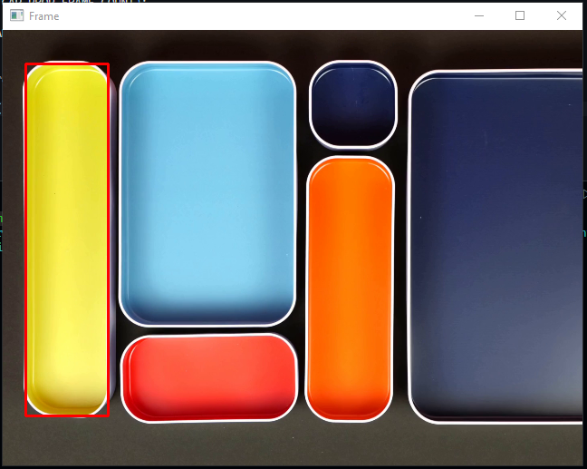
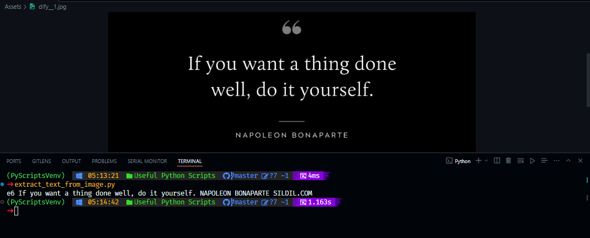

 

# Useful Python Scripts

This repository is a collection of handy Python scripts designed to assist you in various tasks. Whether you're a beginner or an experienced developer, you'll find these scripts useful for automating tasks, simplifying workflows, or just exploring different aspects of Python programming.

## Available Scripts:

### [1. Color Object Detection Script:](detect_objects_with_color.py)

This Python script enables users to detect specific colors within images/videos.

The format of the color a user enters should be in BGR (Blue-Green-Red) format, not RGB.

`⬇Here, we choose yellow color`

### [2. Color Detection Script:](detect_color_in_image.py)

`TODO`

### [3. Text Detection Script:](extract_text_from_image.py)

This Python script enables users to detect text within images.

`Before going to code, you need the following things ⬇️:`

- Download `tesseract-ocr.exe` from `https://github.com/UB-Mannheim/tesseract/wiki`.

- Execute it.

- Copy the installation path: By default it's `C:\Program Files\Tesseract-OCR\tesseract.exe`.

- If needed, add more languages:
  - Download the desired language from `https://tesseract-ocr.github.io/tessdoc/Data-Files#data-files-for-version-400-november-29-2016`.
  - Include them here `C:\Program Files\Tesseract-OCR\tessdata`.

 

`If you have any other scripts or features you'd like to see, feel free to ask`

