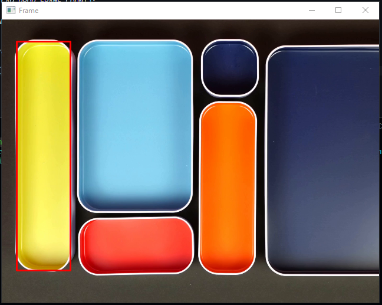

# Useful Python Scripts

This repository is a collection of handy Python scripts designed to assist you in various tasks. Whether you're a beginner or an experienced developer, you'll find these scripts useful for automating tasks, simplifying workflows, or just exploring different aspects of Python programming.

# Available Scripts:

## [Color Detection Script](detect_specific_color_in_image.py):

This Python script enables users to detect specific colors within images/videos.  
`Note:` The format of the color a user enters should be in BGR (Blue-Green-Red) format, not RGB.

    
⬇️ Here, we choose yellow color ⬇️

    

